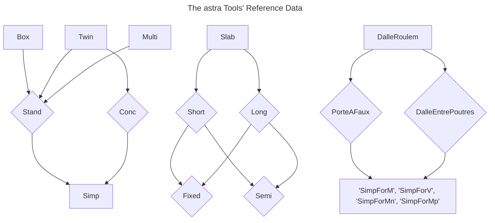

# ASTRA 82001 Calculation tool

La plublication de la documentation OFROU 82001 en 2024 a permis de définir un facteur unique d'actualisation des charges de trafic à utiliser pour l'évaluation structurelle des ponts existants. Lors d'un examen plus détaillé, et dans le but d'éviter des renforcements inutiles des ponts, il est possible d'utiliser des valeurs spécifiques pour les coefficients d'actualisation.

**Cet outil propose un accès simplifié et intuitif à ces coefficients d'actualisation.
-> https://astra-82001.epfl.ch**

## Contributors

- EPFL - RESSLAB : Alain Nussbaumer, Paola Miglietta
- EPFL - ENAC-IT4R : Pierre Guilbert, Charlie Weil
- OFROU : Dimitrios Papastergiou

## Tech stack

- Front-end : [VueJS](https://vuejs.org/), [nginx](https://enginx.io/), [Quasar](url)
- Deployment : [Kubernetes](https://kubernetes.io/)

## Usage

You can use Make with the following command:

        install: Install node dependencies
        install-build: Install node dependencies with npm ci
        build: Build the project (run prebuild before)
        dev: Run the project
        convert: Convert the data to json format
        docker-build: Build docker image locally
        docker-run: Run docker image locally on port 8080

### other commands on local for development:

- npm run lint
  - run eslint on the project
- npm run format
  - run prettier on the project

### Deployment

Development environemnt : https://astra-82001-dev.epfl.ch/
Production environment: https://astra-82001.epfl.ch/

### Data update

Data updates will be handled through pull requests updating [data.csv](https://github.com/EPFL-ENAC/resslab-astra_82001/blob/main/src/assets/data/data.csv)

### Internationalization update

Internationalization will be handled through pull requests updating [internationalization.csv](https://github.com/EPFL-ENAC/resslab-astra_82001/blob/main/src/assets/data/internationalization.csv)

### Report bugs and suggestions

Comments may be shared with developers through [GitHub issues](<[https://github.com/EPFL-ENAC/resslab-astra_82001/blob/main/src/assets/data/data.csv](https://github.com/EPFL-ENAC/resslab-astra_82001/issues)>)

## Status

Under active development. [Report bugs here](https://github.com/EPFL-ENAC/resslab-astra_82001/issues).

## Data graph

